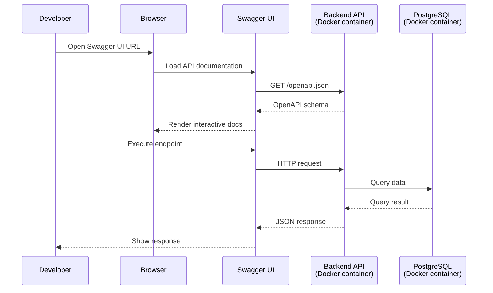

# Explore the API via Swagger UI

<h4>Time</h4>

~30 min

<h4>Purpose</h4>

Learn to explore and test the API using Swagger UI.

<h4>Context</h4>

The backend exposes a REST API for managing learning resources. Swagger UI provides an interactive interface to discover available endpoints, understand request/response formats, and test the API without writing code. This skill is essential for debugging and understanding how the system works.

<h4>Diagram</h4>



<h4>Table of contents</h4>

- [1. Steps](#1-steps)
  - [1.1. Follow the `Git workflow`](#11-follow-the-git-workflow)
  - [1.2. Create an issue](#12-create-an-issue)
  - [1.3. Start the services](#13-start-the-services)
  - [1.4. Open Swagger UI](#14-open-swagger-ui)
  - [1.5. Explore the available endpoints](#15-explore-the-available-endpoints)
  - [1.6. Test the `/items` endpoint](#16-test-the-items-endpoint)
  - [1.7. Test the `/learners` endpoint](#17-test-the-learners-endpoint)
  - [1.8. Test the `/interactions` endpoint](#18-test-the-interactions-endpoint)
  - [1.9. Record your findings](#19-record-your-findings)
  - [1.10. Finish the task](#110-finish-the-task)
  - [1.11. Check the task using the autochecker](#111-check-the-task-using-the-autochecker)
- [2. Acceptance criteria](#2-acceptance-criteria)

## 1. Steps

### 1.1. Follow the `Git workflow`

Follow the [`Git workflow`](../git-workflow.md) to complete this task.

### 1.2. Create a `Lab Task` issue

Title: `[Task] Explore the API via Swagger UI`

### 1.3. Start the services

1. [Check that the current directory is `se-toolkit-lab-5`](../../wiki/shell.md#check-the-current-directory-is-directory-name).
2. [Start the services using `Docker Compose`](../../wiki/docker-compose.md#start-the-services-using-docker-compose).

   You should see log output from the `app`, `postgres`, `pgadmin`, and `caddy` containers.

### 1.4. Open Swagger UI

1. [Open `Swagger UI`](../../wiki/swagger.md#open-swagger-ui).

   You should see the [`Swagger UI`](../../wiki/swagger.md#what-is-swagger-ui) page with the API documentation.

   </img>

### 1.5. Explore the available endpoints

1. Look at the list of available endpoints in Swagger UI.
2. Find the following endpoint groups:
   - `/items`
   - `/learners`
   - `/interactions`
   - `/analytics`
   - `/pipeline`

> [!NOTE]
> Each endpoint group may have multiple HTTP methods (GET, POST, etc.).
> Click on an endpoint to expand it and see its details.

### 1.6. Test the `/items` endpoint

1. Find the `GET /items` endpoint.
2. Click `Try it out`.
3. Click `Execute`.
4. Observe the response.

   You should see a JSON array of items with fields like `id`, `name`, `type`, and `created_at`.

   ```json
   [
     {
       "id": 1,
       "name": "Introduction to Software Engineering",
       "type": "course",
       "created_at": "2025-01-01T00:00:00"
     }
   ]
   ```

> [!NOTE]
> The `/items` endpoint returns all items in the database.
> This is the reference implementation — fully working and ready to study.

### 1.7. Test the `/learners` endpoint

1. Find the `GET /learners` endpoint.
2. Click `Try it out`.
3. Click `Execute`.
4. Observe the response.

   You should see a JSON array of learners.

> [!NOTE]
> Compare the `/learners` response structure with `/items`.
> Notice how each resource has its own schema and table in the database.

### 1.8. Test the `/interactions` endpoint

1. Find the `GET /interactions` endpoint.
2. Click `Try it out`.
3. Click `Execute`.
4. Observe the response.

   You should see interaction records showing what learners did with items.

> [!NOTE]
> Interactions track learner activity: `attempt`, `complete`, and `view` actions.
> You saw this data earlier in [`pgAdmin`](./setup.md#1142-upd-inspect-the-tables).

### 1.9. Record your findings

1. Create a file `lab/tasks/deliverables/task1-questionnaire.md`.
2. Fill in the following template:

   ```markdown
   # Task 1 Questionnaire

   ## 1. How many endpoint groups are available in Swagger UI?

   <answer>

   ## 2. What HTTP method does the `/items` endpoint use?

   <answer>

   ## 3. What fields does the `/items` response contain?

   <answer>

   ## 4. What interaction types did you observe in the `/interactions` response?

   <answer>
   ```

3. Replace each `<answer>` with your actual findings.
4. Save the file.

### 1.10. Finish the task

1. [Create a PR](../git-workflow.md#create-a-pr) with your changes.
2. [Get a PR review](../git-workflow.md#get-a-pr-review) and complete the subsequent steps in the `Git workflow`.

### 1.11. Check the task using the autochecker

[Check the task using the autochecker `Telegram` bot](../../wiki/autochecker.md#check-the-task-using-the-autochecker-bot).

---

## 2. Acceptance criteria

- [ ] Issue has the title `[Task] Explore the API via Swagger UI`.
- [ ] PR exists and is approved.
- [ ] PR is merged.
- [ ] File `lab/tasks/deliverables/task1-questionnaire.md` exists.
- [ ] All answers in the questionnaire are filled in (no `<answer>` placeholders remain).
