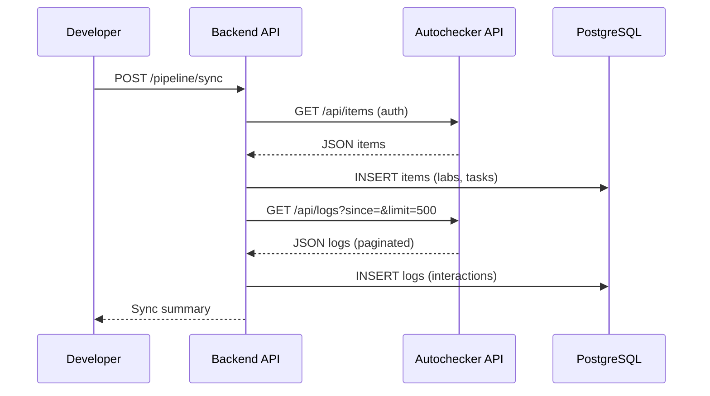

# Build the Data Pipeline

<h4>Time</h4>

~60 min

<h4>Purpose</h4>

Implement an ETL pipeline to sync data from the autochecker API.

<h4>Context</h4>

The autochecker API provides lab/task catalog and interaction logs. You need to fetch this data and load it into the local database so students can see their progress. This task teaches API integration, pagination, and database operations.

<h4>Diagram</h4>



<h4>Table of contents</h4>

- [1. Steps](#1-steps)
  - [1.1. Follow the `Git workflow`](#11-follow-the-git-workflow)
  - [1.2. Create an issue](#12-create-an-issue)
  - [1.3. Configure autochecker credentials](#13-configure-autochecker-credentials)
  - [1.4. Implement `fetch_items()`](#14-implement-fetch_items)
  - [1.5. Implement `fetch_logs()`](#15-implement-fetch_logs)
  - [1.6. Implement `load_items()`](#16-implement-load_items)
  - [1.7. Implement `load_logs()`](#17-implement-load_logs)
  - [1.8. Implement `sync()`](#18-implement-sync)
  - [1.9. Test the pipeline](#19-test-the-pipeline)
  - [1.10. Finish the task](#110-finish-the-task)
  - [1.11. Check the task using the autochecker](#111-check-the-task-using-the-autochecker)
- [2. Acceptance criteria](#2-acceptance-criteria)

## 1. Steps

### 1.1. Follow the `Git workflow`

Follow the [`Git workflow`](../git-workflow.md) to complete this task.

### 1.2. Create a `Lab Task` issue

Title: `[Task] Build the Data Pipeline`

### 1.3. Configure autochecker credentials

1. Open `.env.secret`.
2. Add the following environment variables:

   ```
   AUTOCHECKER_API_URL=https://auche.namaz.live
   AUTOCHECKER_EMAIL=<your-email>
   AUTOCHECKER_PASSWORD=<your-password>
   ```

3. Replace `<your-email>` and `<your-password>` with your autochecker credentials.

### 1.4. Implement `fetch_items()`

Open [`backend/app/etl.py`](../../backend/app/etl.py) and implement `fetch_items()`:

1. Use `httpx.AsyncClient` to GET `{settings.autochecker_api_url}/api/items`.
2. Pass HTTP Basic Auth using `settings.autochecker_email` and `settings.autochecker_password`.
3. Return the parsed JSON list.
4. Raise an exception if the response status is not 200.

```python
async def fetch_items() -> list[dict]:
    async with httpx.AsyncClient() as client:
        response = await client.get(
            f"{settings.autochecker_api_url}/api/items",
            auth=(settings.autochecker_email, settings.autochecker_password),
        )
        response.raise_for_status()
        return response.json()
```

### 1.5. Implement `fetch_logs()`

Implement `fetch_logs(since: datetime | None = None)`:

1. Use `httpx.AsyncClient` to GET `{settings.autochecker_api_url}/api/logs`.
2. Pass query parameters: `limit=500` and `since={iso timestamp}` (if provided).
3. Handle pagination: keep fetching while `has_more` is True.
4. Return the combined list of all log dicts.

```python
async def fetch_logs(since: datetime | None = None) -> list[dict]:
    all_logs: list[dict] = []
    current_since = since

    async with httpx.AsyncClient() as client:
        while True:
            params = {"limit": 500}
            if current_since:
                params["since"] = current_since.isoformat()

            response = await client.get(
                f"{settings.autochecker_api_url}/api/logs",
                params=params,
                auth=(settings.autochecker_email, settings.autochecker_password),
            )
            response.raise_for_status()
            data = response.json()

            logs = data.get("logs", [])
            all_logs.extend(logs)

            if not data.get("has_more", False):
                break

            if logs:
                last_log = logs[-1]
                current_since = datetime.fromisoformat(last_log["submitted_at"])

    return all_logs
```

### 1.6. Implement `load_items()`

Implement `load_items(items: list[dict], session: AsyncSession) -> int`:

1. Import `ItemRecord` from `app.models.item`.
2. Process labs first (items where `type="lab"`):
   - Check if an item with `type="lab"` and matching `title` already exists.
   - If not, INSERT a new `ItemRecord`.
   - Build a dict mapping lab short ID to the lab record.
3. Process tasks (items where `type="task"`):
   - Find the parent lab using the lab short ID.
   - Check if a task with this title and parent_id already exists.
   - If not, INSERT a new `ItemRecord`.
4. Commit and return the count of new items.

### 1.7. Implement `load_logs()`

Implement `load_logs(logs, items_catalog, session) -> int`:

1. Import `Learner`, `InteractionLog`, and `ItemRecord`.
2. Build a lookup from `(lab_short_id, task_short_id)` to item title.
3. For each log:
   - Find or create a `Learner` by `external_id`.
   - Find the matching `ItemRecord` by title.
   - Skip if an `InteractionLog` with this `external_id` already exists.
   - Create a new `InteractionLog` with the log data.
4. Commit and return the count of new interactions.

### 1.8. Implement `sync()`

Implement `sync(session: AsyncSession) -> dict`:

1. Fetch items and load them into the database.
2. Get the last synced timestamp from `InteractionLog`.
3. Fetch logs since that timestamp and load them.
4. Return `{"new_items": ..., "new_records": ..., "total_records": ...}`.

```python
async def sync(session: AsyncSession) -> dict:
    from app.models.interaction import InteractionLog

    # Step 1: Fetch and load items
    items = await fetch_items()
    new_items = await load_items(items, session)

    # Step 2: Get last synced timestamp
    last_log = session.exec(
        InteractionLog.order_by(InteractionLog.created_at.desc())
    ).first()
    since = last_log.created_at if last_log else None

    # Step 3: Fetch and load logs
    logs = await fetch_logs(since)
    new_logs = await load_logs(logs, items, session)

    # Get total count
    total = session.exec(
        InteractionLog.select().count()
    ).one()

    return {
        "new_items": new_items,
        "new_records": new_logs,
        "total_records": total,
    }
```

### 1.9. Test the pipeline

1. [Start the services](./setup.md#111-start-the-services).
2. Open `Swagger UI` at `http://localhost:8000/docs`.
3. Find `POST /pipeline/sync` endpoint.
4. Click `Try it out` → `Execute`.
5. You should see a response like:

   ```json
   {
     "new_items": 10,
     "new_records": 50,
     "total_records": 50
   }
   ```

### 1.10. Finish the task

1. [Create a PR](../git-workflow.md#create-a-pr) with your changes.
2. [Get a PR review](../git-workflow.md#get-a-pr-review) and complete the subsequent steps in the `Git workflow`.

### 1.11. Check the task using the autochecker

[Check the task using the autochecker `Telegram` bot](../../wiki/autochecker.md#check-the-task-using-the-autochecker-bot).

---

## 2. Acceptance criteria

- [ ] Issue has the title `[Task] Build the Data Pipeline`.
- [ ] PR exists and is approved.
- [ ] PR is merged.
- [ ] `fetch_items()` fetches from the autochecker API with auth.
- [ ] `fetch_logs()` handles pagination correctly.
- [ ] `load_items()` inserts labs and tasks without duplicates.
- [ ] `load_logs()` inserts interaction logs with learner/item references.
- [ ] `sync()` orchestrates the full pipeline and returns correct summary.
- [ ] `POST /pipeline/sync` endpoint returns a valid response.
